# phoneHome

*<h3>Your phone - just as "smart" as you want it to be.</h3>*

<!---  --->

<hr>

# What is phoneHome?
```
           ______    ____
        /         \-      \
      /    ____/  _  \____  \ 
     |  ,(( ◕)\  _  /( ◕)), |
      \        /(,-,)\       /     ✧
        \     /   |   \    /      〇 ✧
          \    -.___.-   /         \\
             \   __   /             ||
              |  _   |             _| --_
              \   _  |            | _\ ,//
               \  _   \            \    /
          ___  /   __   \ ____      |  |
        /            _          \  /   |
      /    __                     __  /_
     ___  / /_  ____  ____  ___  / / / /___  ____ ___  ___
   / __ \/ __ \/ __ \/ __ \/ _ \/ /_/ / __ \/ __ `__ \/ _ \
  / /_/ / / / / /_/ / / / /  __/ __  / /_/ / / / / / /  __/
 / .___/_/ /_/\____/_/ /_/\___/_/ /_/\____/_/ /_/ /_/\___/
/_/

>searching for modules...
```

<h2>phoneHome is a suite of tools to make dumbphones smarter</h2>

phoneHome runs on any old computer you have lying around (so long as it's got ___innanet___),
<br>and executes this main loop ad infinitum:

1. listen for incoming SMS text messages
2. attempt to interpret recieved messages as commands
3. if a recieved message contains a recognized command, execute the command, then...
4. send a response back to the user as an SMS text message
</i>
<br>
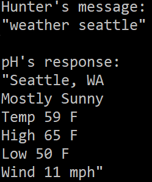

<h2>phoneHome is modular</h2>

phoneHome's modular design allows you pick and choose the features you want, rendering your phone <br>
_"just as smart as you want it to be."_

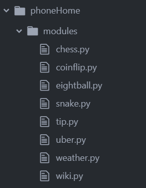

<h2>phoneHome is multi-user</h2>

A freedom most unprecidented - any number of users can interact with the software simultaneously.

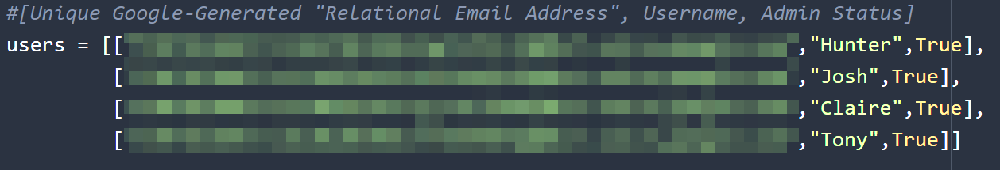

Commands are evaluated in the order they are recieved, and multiplayer, text-based games are possible (2 player, SMS text-based Chess has already been implemented, and a Multi-User Dungeon Crawler has been planned).

# Okay... but _Why?_

___Smartphone Addiction___ is a very real and very serious condition that affects an estimated....... __everyone.__

The obvious-but-hard-to-swallow cure for Smartphone Addiction is, obviously, ditching your smartphone.

But, unless you're a hippie or a cave hermit, you'll probably still want to carry _something_ around in your pocket for talking to people... just maybe something with a few less distracting features... something so uninteresting that you won't get addicted to it... something like

<h3>A dumb phone.</h3>


There is a very real honeymoon phase.<br><br>
You've got everything you need, and nothing you don't.<br>
It's elegant!<br>
It's nostalgic!<br>
It's... <b>ａｅｓｔｈｅｔｉｃ.</b>

You won't miss Facebook or the incessant notifications, but soon enough you'll find yourself missing the useful tools that those so-called-smartphones come with as standard:
<br><br>
>_"It sure would be nice to know today's weather forecast....." <br><br>
>"I wish I didn't have to call my brother to ask for Google Maps directions......" <br><br>
>"WTF is a 'kumquat'.....?"<br><br>
>"ok....... what if I could summon an uber............. from a dumbphone..............."_
<br>

# Anything You Can Do, I Can Do ~~Better~~ Too

Use these and other modules to augment your abilities.

<h2>weather feature</h2>
finally, an answer to the age old question: will it rain today?
<br><br>
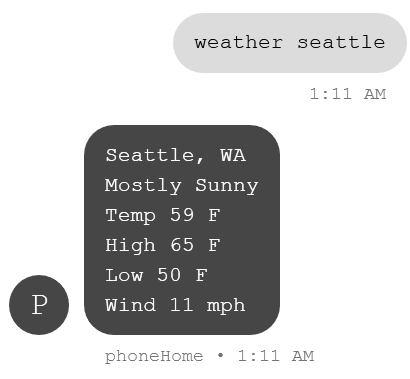

<h2>encyclopedia feature</h2>
can you remember a time before the internet?<br>

when, if you had a question, you just had to _wonder_ for a while..?<br>

well those days are long over.
<br>

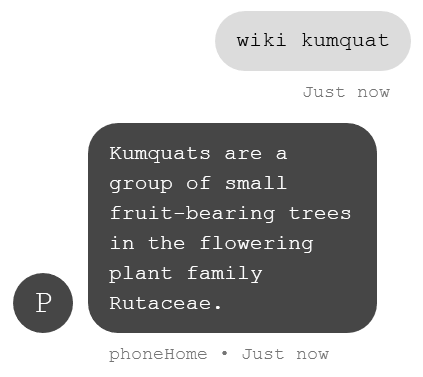

<h2>tip calculator</h2>

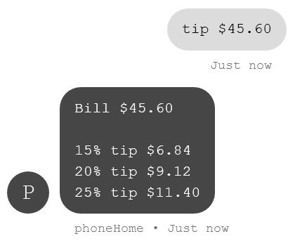


<h2>camera feature</h2>
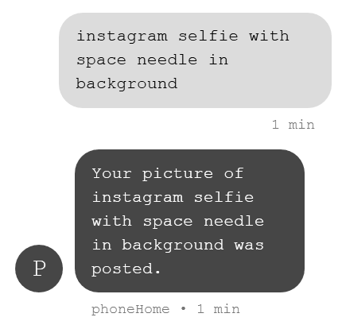

almost everything you could ever want to capture with a photograph has already been captured in a photograph.

phoneHome uses an advanced image generation algorithm (aka Google images) to "generate" images based on your text description of the scene you see before you.

images are uploaded to <b><a href="http://www.instagram.com/huntersdumbphone">The Cloud™</a></b> where your friends can like™ and comment™ on (approximations of) your exciting life.
<br>
<br>


<h2>magic 8-ball</h2>
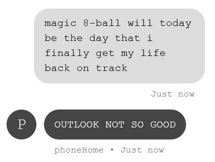

<h2>chess</h2>
a game of skill for two players.
<br>
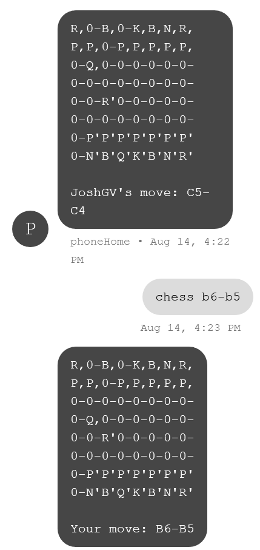

<h2>snake</h2>
that old Nokia 3310 standby, reimagined for the modern age.

as it's played on a frame-by-frame basis, this version is more of a "thinkin' man's game"

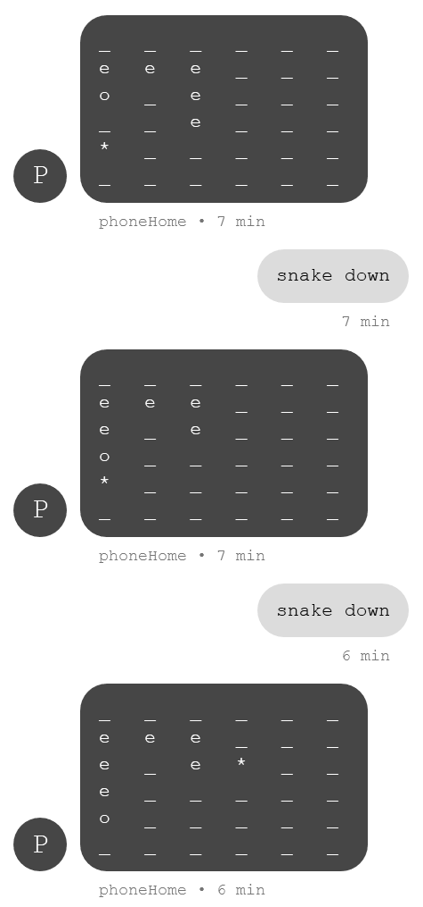

<h2>uber</h2>
Get from "where you are" to "where you wish you were" in no time flat.

<br><br>
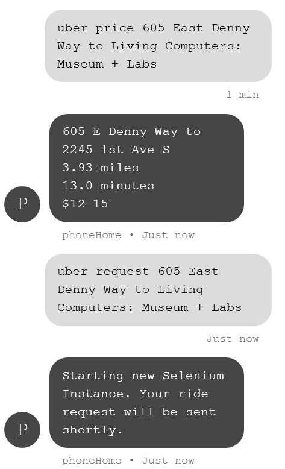


<br><br>
<hr>

# Installation Instructions

uh.. coming soon

# At Your Service
If you have any questions or need help setting up a phoneHome server of your own, feel free to <b><a href="https://github.com/hunterirving/phoneHome/issues">open an issue</a>!</b>

I'd be more than happy to help you figure things out :-)

# Credits
>phoneHome is one part joke, one part real-life useful tool, and two parts cool party trick.
>
>developed by Hunter and Josh Irving in 2018.
