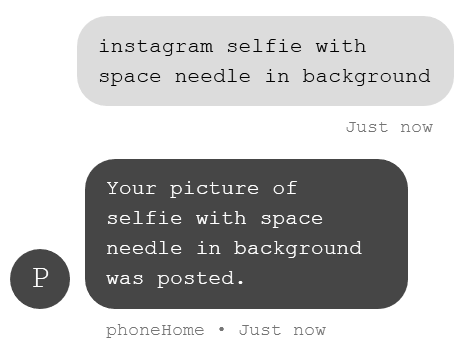

# phoneHome

Use these and other modules to augment your abilities.

<h2>weather feature</h2>
finally, an answer to the age old question: will it rain today?
  

<h2>encyclopedia feature</h2>
can you remember a time before the internet? 

when, if you had a question, you just had to _wonder_ for a while..? 

well those days are long over.
 

<h2>tip calculator</h2>

<h2>camera feature</h2>

almost everything you could ever want to capture with a photograph has already been captured in a photograph.

phoneHome uses an advanced image generation algorithm (aka Google images) to "generate" images based on your text description of the scene you see before you.

images are uploaded to <b><a href="http://www.instagram.com/huntersdumbphone">The Cloud™</a></b> where your friends can like™ and comment™ on (approximations of) your exciting life.
 
 

<h2>magic 8-ball</h2>

<h2>chess</h2>
a game of skill for two players.
  

<h2>snake</h2>
that old Nokia 3310 standby, reimagined for the modern age.

as it's played on a frame-by-frame basis, this version is more of a "thinkin' man's game"

<h2>uber</h2>
Get from "where you are" to "where you wish you were" in no time flat.
 

  

# Credits
>phoneHome is one part joke, one part real-life useful tool, and two parts cool party trick.
>
>developed by Hunter and Josh Irving in 2018!
